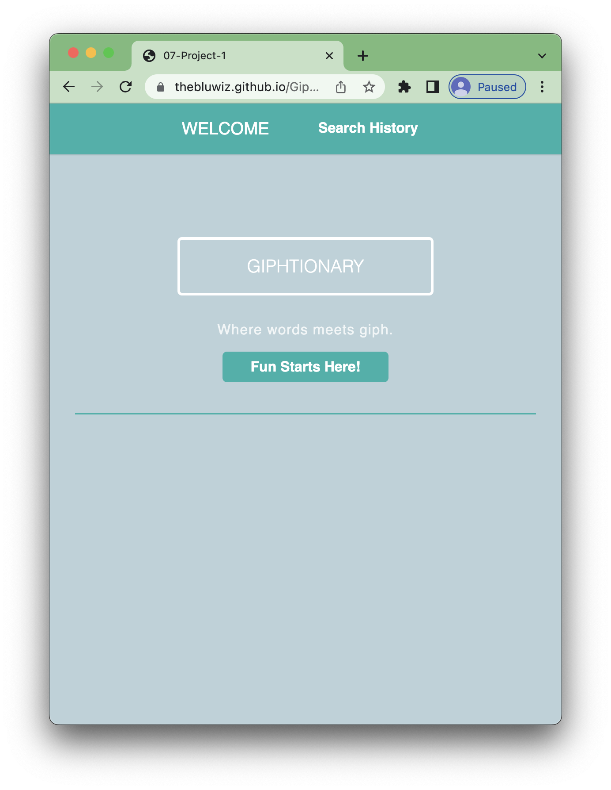

# Giphtionary

## Description

Where words meets giph! A vanilla JS app to check word definitions that displays complementary GIFs. 

## APIs/Frameworks
- <a href="https://dictionaryapi.com/" >Merriam Webster API</a>
- <a href="https://developers.giphy.com/" >Giphy API</a>
- <a href="https://purecss.io/" >Pure.css</a>
- <a href="https://www.freecodecamp.org/" >freeCodeCamp</a>

## User Story

AS A student 
I WANT to look up the definition of a word and use a GIPH to provide a visual example 
So THAT I can gain a better understanding of different words.

## License

Please refer to the LICENSE in the repo.

## Deployed
Find our site [here](https://TheBluWiz.github.io/Giphtionary/)!

## Contact

<a href="https://www.linkedin.com/in/jamey-wicklund-19673851/" >LinkedIn: Jamey Wicklund</a>

<a href="https://www.linkedin.com/in/carrie-k-young/" >LinkedIn: Carrie Young</a>

<a href="https://www.linkedin.com/in/emilia-trentham-987a59164/" >LinkedIn: Emilia Trentham</a>

<a href="https://github.com/TheBluWiz">GitHub: TheBluWiz</a>